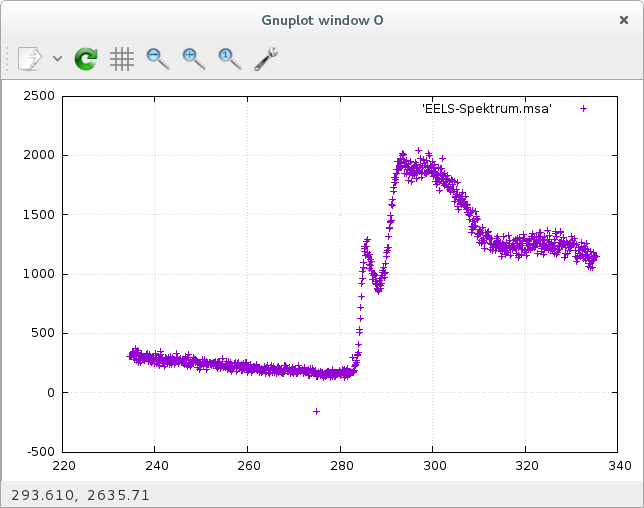
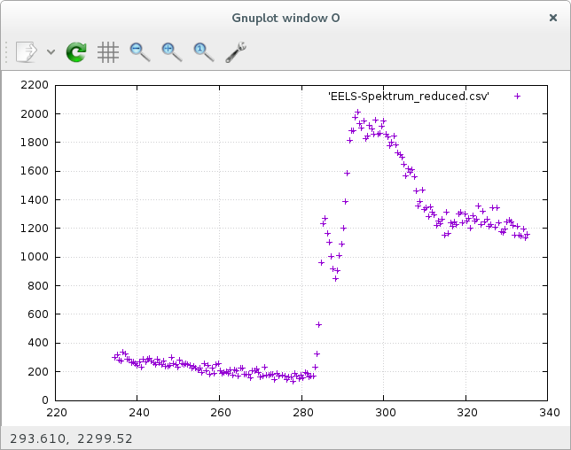
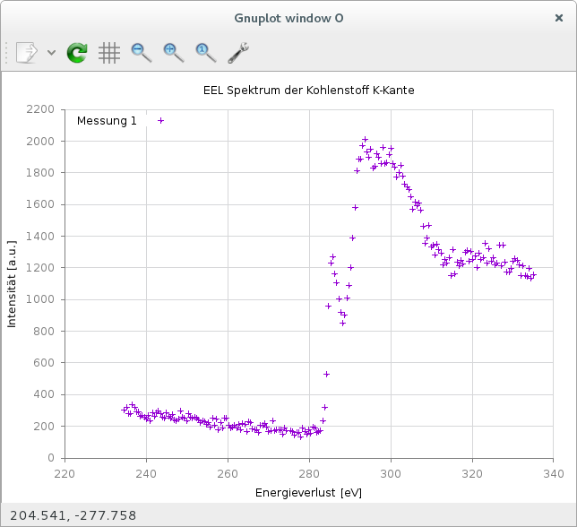
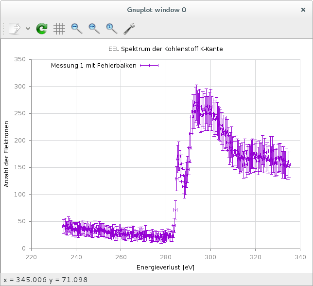

# Kurzanleitung zu Gnuplot 5
Eine kurze Einführung in die Verwendung von Gnuplot 5 für Physiker.

## Motivation

Mit der Version 5 hat Gnuplot einige Änderungen bei der Syntax erfahren. Im Internet findet man zwar viele Anleitungen, die einem die Nutzung von Gnuplot erklären, leider beziehen sich diese noch auf Version 4.x. Besonders bei Fehlerbalken und dem Fitten von Funktionen kommt es zu Fehlern, wenn man die Gnuplot 4 Syntax in Gnuplot 5 verwendet. Diese Anleitung bezieht sich nur auf Gnuplot 5 und richtet sich ein Einsteiger, die vorher noch nicht mit Gnuplot gearbeitet haben.

## Gnuplot installieren und starten

### Linux

Gnuplot ist eine OpenSource Software und sollte deshalb in den Paketquellen aller Linux-Distributionen vorhanden sein. Bei Debian 8 genügt z.B. das Ausführen von ``sudo apt install gnuplot5``, um Gnuplot 5 zu installieren. Gibt man ``gnuplot`` statt ``gnuplot5`` an, erhält man noch die alte Version 4.6.6. Anschließend kann man in der Bash ``gnuplot5`` aufrufen, um das Programm auszuführen.

### Windows

Alle Bisher veröffentlichten Versionen gibt es bei [sourceforge als Download][download]. Man muss nur die passende Version wählen (32bit oder 64bit, sowie Installer oder ZIP-Archiv) und diese installieren/entpacken. Enthalten ist die ausführbare Datei *wgnuplot.exe* (im Ordner *bin*), mit der man die Textkonsole von Gnuplot startet.

## Die Daten begutachten

Diese Kurzanleitung verwendet die Beispieldateien aus dem Ordner *Daten*. Dort ist eine README-Datei zu finden, die erläutert, wie die unterschiedlichen csv-Dateien erzeugt wurden.

Zuerst möchte ich den Datensatz *EELS-Spektrum.msa* begutachten. Dazu führe ich

```Gnuplot
# Dies ist ein Kommentar.
# Der Dateiname muss von Anführungszeichen umschlossen sein (egal ob einfache oder doppelte).
plot 'EELS-Spektrum.msa'
```

aus, wodurch sich ein neues Fenster öffnen sollte, welches folgendes Diagramm zeigt:



Es ist gut zu sehen, dass sich die 1024 Datenpunkte überlappen. Im Folgenden möchte ich deshalb mit dem Datensatz *EELS-Spektrum_reduced.csv* arbeiten, der nur jeden fünften Datenpunkt enthält.

```Gnuplot
plot 'EELS-Spektrum_reduced.csv'
```



Tipp:
	Normalerweise zeigt Gnuplot keine Gitterlinien an. Diese kann man jedoch über den entsprechenden Button in der grafischen Oberfläche aktivieren, oder man führt den Befehl ``set grid`` aus.

## Das Diagramm verbessern

Die bisher erstellten Diagramme sind nicht besonders informativ. Es gibt weder einen Titel, noch sind die Achsen beschriftet. Außerdem zeigt die schlecht platzierte Legende nur den Namen der verwendeten Datei an. Wie es besser geht, dass zeigt [EELS-Kohlenstoff1.plt].

Alle zum Plotten notwendigen Befehle sind in einer Datei zusammengefasst. Mit dem Befehl ``gnuplot5 -p EELS-Kohlenstoff1.plt`` kann man das Script in der Bash ausführen. der Parameter ``-p`` ist notwendig, damit das Diagramm auch angezeigt wird. Schreibt man in eine Datei (siehe Unten), kann man ``-p`` auch weglassen.

Mit Hilfe von ``load 'EELS-Kohlenstoff1.plt'`` kann man das Script innerhalb von Gnuplot ausführen. Dass das Script ``set loadpath`` benutzt, hat keinen Einfluss darauf, da nur in einem zusätzlichen Verzeichnis nach zu ladenden Dateien gesucht wird. Außerdem sind alle genutzten Befehle noch aktiv und man kann mit ``replot`` den zuletzt genutzten plot-Befehl erneut ausführen.

```Gnuplot
# Ermöglicht die direkte Eingabe diverser Sonderzeichen.
set encoding utf8

# Titel und Label werden in Anführungszeichen hinter den jeweiligen Befehlen angegeben.
set title 'EEL Spektrum der Kohlenstoff K-Kante'
set xlabel 'Energieverlust [eV]'
set ylabel 'Intensität [a.u.]'

# Die Legende heißt bei Gnuplot key. Mögliche Optionen sind:
# 	inside|outside, left|right|center und top|bottom|center (weitere: siehe Anleitung).
set key inside left top

# Es ist sehr praktisch Vorlagen zu verwenden.
# Auf gnuplotting.org wird deren Verwendung detailliert erklärt.
# Gibt an, welches Verzeichnis für 'load' benutzt wird.
set loadpath './config'
# Stellt die Achsen weniger in den Vordergrund, damit die eigentlich Daten mehr Aufmerksamkeit erhalten.
load 'xyborder.cfg'
# Verbessert die Darstellung der Gitterlinien.
load 'grid.cfg'

# An 'plot' wird der zusätzliche Parameter 'title' übergeben.
# Auf den Parameter muss ein String folgen, der den Datensatz beschreibt.
# Da sich die Datei 'EELS-Spektrum_reduced.csv' in einem Unterordner (Daten) befindet,
# müssen wird diesen mit angeben.
plot 'Daten/EELS-Spektrum_reduced.csv' title 'Messung 1'
```

Details zu den verwendeten Vorlagen sind auf [gnuplotting.org] zu finden.




Vergleiche [EELS-Kohlenstoff1.plt](https://github.com/m-entrup/Kurzanleitung-zu-Gnuplot-5/blob/master/EELS-Kohlenstoff1.plt).

### Replot verwenden

Dies ist ein einfaches Beispiel, welches die Verwendung von ``replot`` demonstriert:

```Gnuplot
load 'EELS-Kohlenstoff1.plt'
set title 'Dies ist ein neuer Titel!'
replot
```

## Das Diagramm als Bilddatei abspeichern

Dieser Schritt ist ganz einfach, wenn man die grafische Oberfläche verwendet. In der Titelleiste jedes Plots zeigt Gnuplot eine Reihe von Buttons an, von denen der erste Button dazu dient, Diagramme zu exportieren/speichern.

Eine weitere Möglichkeit bietet der Befehl ``set terminal``. Man sollte sich zuerst vergewissern, welche Terminals installiert sind. Dazu ruft man ``help terminal`` auf. In dieser Anleitung werde ich mich auf das Terminal *png* beschränken.

```Gnuplot
set encoding utf8

set title 'EEL Spektrum der Kohlenstoff K-Kante'
set xlabel 'Energieverlust [eV]'
set ylabel 'Intensität [a.u.]'
set key inside top left

set loadpath './config'
load 'xyborder.cfg'
load 'grid.cfg'

# Nur 3 der nächsten 4 Zeilen Code sind neu.
# 'png' ist das Terminal, welches verwendet werden soll.
# Mit 'enhanced' aktiviert man Hoch- und Tiefstellen von Zeichen, sowie weitere Sonderfunktionen.
# Die Größe wird hier in Pixeln (Breite,Höhe) angegeben.
# Alternativ können die Einheiten cm und inch benutzt werden. Die Auflösung beträgt dann 72 dpi.
# Mit 'font' ändert man die Schrift. In diesem Fall wird nur die Schriftgröße angepasst.
set terminal png enhanced size 800,600 font ',16'
# Dieser Befehl gibt den Namen der Bilddatei an.
set output 'EELS-Spektrum_reduced.png'

plot 'Daten/EELS-Spektrum_reduced.csv' title 'Messung 1'

# Die Datei wird geschlossen, damit man sie problemlos ansehen kann.
unset output
# Setzt das Terminal auf den Standard zurück.
unset terminal
```

Vergleiche [EELS-Kohlenstoff2.plt](https://github.com/m-entrup/Kurzanleitung-zu-Gnuplot-5/blob/master/EELS-Kohlenstoff2.plt).

## Fehlerbalken benutzen

Messwerte sind immer mit Unsicherheiten behaftet. Um diese grafisch darzustellen, benutzt man in Gnuplot Fehlerbalken.

Der Datensatz *EELS-Spektrum_err.csv* enthält eine zusätzliche Spalte mit den Unsicherheiten der y-Werte. Die folgenden Beispiele zeigen, wie man variable und Konstante Unsicherheiten in Gnuplot nutzt.

```Gnuplot
set encoding utf8

set title 'EEL Spektrum der Kohlenstoff K-Kante'
set xlabel 'Energieverlust [eV]'
set ylabel 'Intensität [a.u.]'
set key inside top left

set loadpath './config'
load 'xyborder.cfg'
load 'grid.cfg'

# Der Parameter 'with' ermöglicht die Angabe des Diagramm-Typs (hier: y-Fehlerbalken).
# 'yerrorbars' erwartet einen Datensatz mit 3 Spalten, was bei 'EELS-Spektrum_err.csv' zutrifft.
plot 'Daten/EELS-Spektrum_err.csv' with yerrorbars title 'Messung 1 mit Fehlerbalken'
```


Vergleiche [EELS-Kohlenstoff_Fehlerbalken1.plt](https://github.com/m-entrup/Kurzanleitung-zu-Gnuplot-5/blob/master/EELS-Kohlenstoff_Fehlerbalken1.plt).

### X-Y-Fehlerbalken

Für zusätzliche Fehlerbalken für die X-Werte müssen wir den Diagramm-Typ ``xyerrorbars`` verwenden. Dieser erwartet einen Datensatz mit 4 Spalten, den wir mit Hilfe des Parameters ``using`` generieren.

```Gnuplot
# Es wird nur der im Vergleich zum letzten Beispiel geänderte Code-Zeile gezeigt.

# Bei Nutzung von 'using' gibt man durch Doppelpunkte getrennt die Spalten an.
# Einfache Zahlen beziehen sich auf die Spaltennummer (hier: 1, 2 und 3).
# In runden Klammern kann man rechnen. In diesem Beispiel wird jedoch nur der konstante Wert 0.7 'berechnet'.
plot 'Daten/EELS-Spektrum_err.csv' using 1:2:(0.7):3 with xyerrorbars title 'Messung 1 mit Fehlerbalken'
```




Vergleiche [EELS-Kohlenstoff_Fehlerbalken2.plt](https://github.com/m-entrup/Kurzanleitung-zu-Gnuplot-5/blob/master/EELS-Kohlenstoff_Fehlerbalken2.plt).

Die Spalte 3 wurde aus den Werten in Spalte 2 berechnet (siehe README.md im Ordner Daten). Dies kann man auch direkt im Script anwenden:

```Gnuplot
# Das $-Zeichen muss innerhalb der Runden Klammer (bei using) benutzt werden, damit man auf die 2te Spalte zugreifen kann.
# sqrt() ist eine von Gnuplot bereitgestellte Funktion. Es gibt viele weitere, wie z.B. sin() und cos().
plot 'Daten/EELS-Spektrum_err.csv' using 1:2:(0.7):(2*sqrt($2)) with xyerrorbars title 'Messung 1 mit Fehlerbalken'
```

Man kann außerdem die Werte aus unterschiedlichen Spalten in eine Rechnung einbeziehen. ``using 1:($2/$3)`` nutzt die Werte aus Spalte 1 als x-Werte und teilt die Werte aus Spalte 2 durch die Werte aus Spalte 3, um die y-Werte zu berechnen.

[download]: https://sourceforge.net/projects/gnuplot/files/gnuplot/
[EELS-Kohlenstoff1.plt]: https://github.com/m-entrup/Kurzanleitung-zu-Gnuplot-5/blob/master/EELS-Kohlenstoff1.plt
[gnuplotting.org]: http://www.gnuplotting.org/?p=1994
